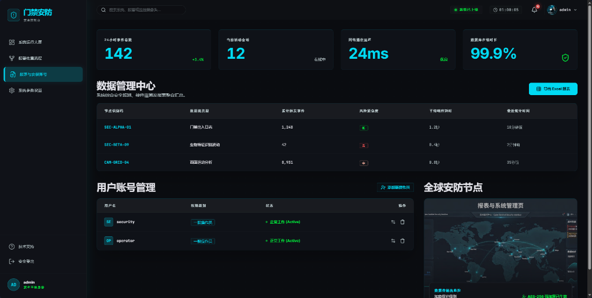
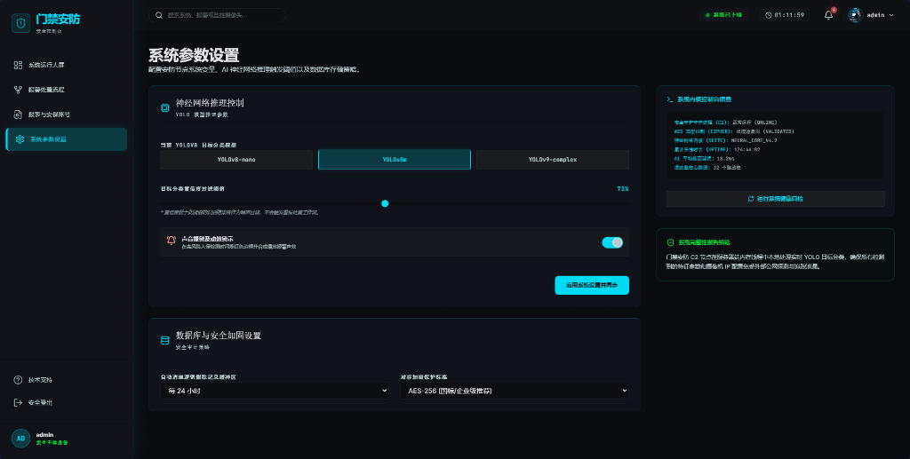
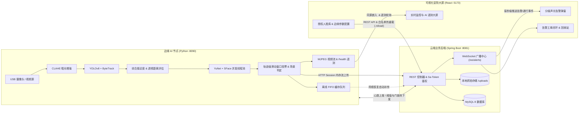
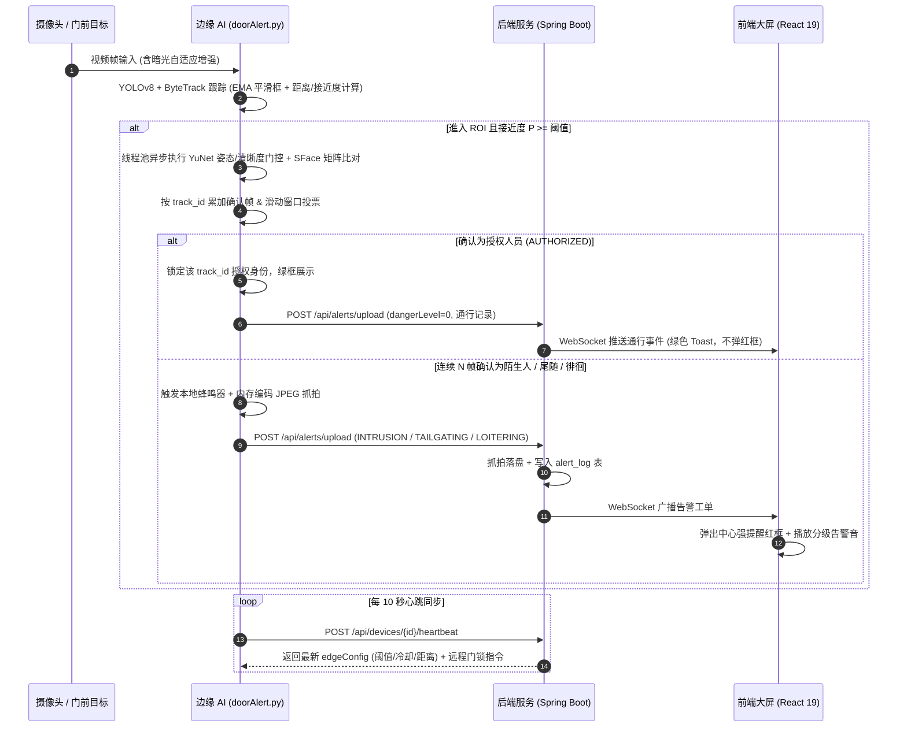

<div align="center">


# Intelligent Door Alert System

**基于 YOLOv8 + ByteTrack 与 YuNet/SFace 的智能门禁安防可视化预警系统**

边缘实时行人跟踪 · 透视距离与接近度评估 · 多目标并发人脸核验 · 尾随/徘徊检测 · 云边协同大屏

[](https://github.com/Ckj6818/intelligent-door-alert-system/actions/workflows/ci.yml)
[](https://github.com/Ckj6818/intelligent-door-alert-system/releases)
[](./LICENSE)
[](https://www.python.org/)
[](https://github.com/ultralytics/ultralytics)
[](https://opencv.org/)
[](https://spring.io/projects/spring-boot)
[](https://react.dev/)
[](https://www.docker.com/)

[核心亮点](#-核心亮点) · [界面预览](#-界面预览) · [系统架构](#-系统架构与数据流) · [核心算法](#-核心视觉算法) · [快速启动](#-快速启动) · [接口与配置](#-接口与配置速查)

</div>

---

## 📖 项目简介

**Intelligent Door Alert System** 是一套面向机房、实验室、重点库房等场景的 **云边协同智能门禁安防系统**（本科毕业设计作品）。系统由 **Python 边缘 AI 视觉节点**、**Spring Boot 3 业务与实时推送后端** 以及 **React 19 赛博安防可视化大屏** 三部分组成，完整覆盖从「实时视频流感知 → 身份核验与异常行为判定 → 毫秒级告警推送 → 工单闭环处置与报表导出」的全业务链路。

| 模块 | 核心职责 | 关键技术 |
|:---|:---|:---|
| **边缘 AI 节点** (`door-alert-ai`) | 视频流采集、暗光增强、行人检测与跟踪、透视距离与接近度门控、多目标并发人脸比对、离线缓存、MJPEG 实时流与 `/health` 遥测服务 | `YOLOv8` + `ByteTrack`、`YuNet` + `SFace`、`CLAHE`、`ThreadPool` |
| **云端业务后端** (`door-alert-backend`) | 告警与授权通行落库、WebSocket 实时广播、心跳监测与边缘参数热下发、远程门锁控制、白名单同步、工单流转与 EasyExcel 报表导出 | `Spring Boot 3.2`、`MyBatis-Plus`、`Sa-Token`、`WebSocket`、`MySQL 8` |
| **安防可视化大屏** (`door-alert-frontend`) | 同源嵌入 MJPEG 实时检测流、动态渲染 AI 推理遥测曲线（FPS / 延迟）、分级声光告警弹窗、告警工单闭环、授权人脸管理、回收站与审计中心 | `React 19`、`TypeScript`、`Vite 6`、`Tailwind CSS 4`、`Web Audio API` |

---

## ✨ 核心亮点

<table>
<tr>
<td width="50%" valign="top">

### 🎯 1. 融合透视距离与轨迹平滑的目标感知
- **ByteTrack 持久跟踪**：维护门前目标唯一 `track_id`、运动趋势（`靠近 / 远离 / 路过`）与防区滞留时长。
- **综合接近度与距离估计**：融合框面积占比、底部接地点垂直位置与透视距离因子，支持多边形/矩形 ROI 警戒区判定与 `SAFE / WARN / DANGER` 三档距离分层。
- **检测框 EMA 滤波**：按 `track_id` 对边界框坐标做指数滑动平均平滑，消除近距离抖动并稳定距离估计。

</td>
<td width="50%" valign="top">

### ⚡ 2. YuNet + SFace 高速高准身份核验
- **姿态与清晰度门控**：利用 YuNet 5 关键点计算鼻尖对称度过滤大角度侧脸，结合拉普拉斯方差过滤运动模糊帧，侧脸/模糊帧保持「识别中」不误触发陌生人告警。
- **双模板预归一化矩阵匹配**：底库加载支持「全图优先 + 上半身回退」检测与水平翻转双模板增广，预归一化为连续 `float32` 矩阵，实时比对仅需单次矩阵点乘。
- **多目标并发与轨迹级防抖**：基于 `threading.local()` 算子实例与复用线程池并发识别多目标；按 `track_id` 独立维护滑动窗口投票与确认帧计数，一旦确认为授权人员即锁定身份缓存。

</td>
</tr>
<tr>
<td width="50%" valign="top">

### 🛡️ 3. 多场景异常识别与边缘高可用
- **三类核心安防事件**：
  - `INTRUSION`：非授权人员/陌生人进入近场防区告警
  - `TAILGATING`：授权人员通行后短时间窗口内陌生人尾随闯入告警
  - `LOITERING`：门前防区长时间遮挡徘徊超时告警
- **CLAHE 自适应暗光增强**：夜间或背光走廊自动启用 LAB 空间亮度自适应均衡并动态补偿检测阈值。
- **断网 FIFO 离线缓存与云边热同步**：后端断联时抓拍与元数据自动落盘队列，网络恢复后按序补传；心跳响应实时热更新冷却窗口、人脸阈值、危险距离与门锁状态。

</td>
<td width="50%" valign="top">

### 🖥️ 4. 实时遥测大屏与闭环工单管理
- **零延迟 MJPEG 预览与真实遥测**：边缘端 `8090` 端口提供局部贴片渲染的高对比度中文 HUD 视频流，并通过 `/health` 暴露实时 `FPS`、`YOLO 耗时`、`SFace 耗时` 与目标人数，驱动前端动态曲线。
- **分级声光告警与通行分离**：授权通行仅记录通行日志与轻量提示；未授权/尾随/徘徊触发全屏红框强提醒与 Web Audio 分频告警音效。
- **全生命周期数据治理**：支持告警派单、处置归档、逻辑回收站（永久清空时同步安全清理磁盘抓拍图片，防磁盘占满）及 Excel 审计报表导出。

</td>
</tr>
</table>

---

## 🖼️ 界面预览

| 数据管理与安全审计中心 | 神经网络推理控制与系统参数配置 |
|:---:|:---:|
|  |  |

---

## 🏗️ 系统架构与数据流

### 拓扑架构


```mermaid
flowchart LR
  subgraph Edge ["边缘 AI 节点 (Python :8090)"]
    Cam["USB 摄像头 / 视频源"] --> CLAHE["CLAHE 暗光增强"]
    CLAHE --> YOLO["YOLOv8 + ByteTrack"]
    YOLO --> Prox["综合接近度 & 透视距离评估"]
    Prox --> Pool["YuNet + SFace 并发线程池"]
    Pool --> Judge["轨迹级滑动窗口投票 & 场景判定"]
    Judge --> Stream["MJPEG 视频流 & /health 遥测"]
    Judge --> Cache["离线 FIFO 缓存队列"]
  end

  subgraph Cloud ["云端业务后端 (Spring Boot :8081)"]
    API["REST 控制器 & Sa-Token 鉴权"]
    WS["WebSocket 广播中心 (/ws/alerts)"]
    Disk[("本地抓拍存储 /uploads")]
    DB[("MySQL 8 数据库")]
    API --> DB
    API --> Disk
    API --> WS
  end

  subgraph Web ["可视化安防大屏 (React :5173)"]
    Live["实时监控与 AI 遥测大屏"]
    Popup["分级声光告警弹窗"]
    Workflow["告警工单闭环 & 回收站"]
    AuthMgr["授权人脸库 & 边缘参数配置"]
  end

  Judge -- "HTTP Session 内存流上传" --> API
  Cache -. "网络恢复自动补传" .-> API
  Edge <-- "心跳上报 / 阈值与门锁热下发" --> API
  Stream -- "同源嵌入 <img> & 遥测轮询" --> Live
  WS -- "毫秒级推送告警/通行事件" --> Popup
  WS --> Workflow
  AuthMgr -- "REST API & 白名单热重载 (.reload)" --> API
```

### 核心告警与通行时序


```mermaid
sequenceDiagram
  autonumber
  participant C as 摄像头 / 门前目标
  participant E as 边缘 AI (doorAlert.py)
  participant B as 后端服务 (Spring Boot)
  participant W as 前端大屏 (React 19)

  C->>E: 视频帧输入 (含暗光自适应增强)
  E->>E: YOLOv8 + ByteTrack 跟踪 (EMA 平滑框 + 距离/接近度计算)
  alt 進入 ROI 且接近度 P >= 阈值
    E->>E: 线程池异步执行 YuNet 姿态/清晰度门控 + SFace 矩阵比对
    E->>E: 按 track_id 累加确认帧 & 滑动窗口投票
    alt 确认为授权人员 (AUTHORIZED)
      E->>E: 锁定该 track_id 授权身份，绿框展示
      E->>B: POST /api/alerts/upload (dangerLevel=0, 通行记录)
      B->>W: WebSocket 推送通行事件 (绿色 Toast，不弹红框)
    else 连续 N 帧确认为陌生人 / 尾随 / 徘徊
      E->>E: 触发本地蜂鸣器 + 内存编码 JPEG 抓拍
      E->>B: POST /api/alerts/upload (INTRUSION / TAILGATING / LOITERING)
      B->>B: 抓拍落盘 + 写入 alert_log 表
      B->>W: WebSocket 广播告警工单
      W->>W: 弹出中心强提醒红框 + 播放分级告警音
    end
  end
  loop 每 10 秒心跳同步
    E->>B: POST /api/devices/{id}/heartbeat
    B-->>E: 返回最新 edgeConfig (阈值/冷却/距离) + 远程门锁指令
  end
```

---

## 🧠 核心视觉算法

<details open>
<summary><b>1. 透视接地点距离估计与综合接近度模型</b></summary>

单一的检测框面积占比在目标半身出画或不同俯仰角下容易失真。本系统引入 **检测框底部接地点垂直位置** 与 **透视距离因子** 构建综合接近度 $P \in [0, 1]$：

$$
R_{\text{area}} = \frac{(x_2 - x_1)(y_2 - y_1)}{W \cdot H}, \quad R_{\text{foot}} = \frac{y_2}{H}, \quad d_{\text{factor}} = \frac{H - y_2}{(y_2 - y_1) + \varepsilon}
$$

$$
S_{\text{persp}} = \frac{1}{1 + 1.8 \cdot d_{\text{factor}}}, \quad P = \text{clip}\Big(0.45\,\min(1, 2.2 R_{\text{area}}) + 0.30\,R_{\text{foot}} + 0.25\,S_{\text{persp}},\; 0,\; 1\Big)
$$

同时结合像素身高与地面透视估计物理距离 $D_{\text{est}}$（单位：米），划分为 `DANGER`（$\le 1.5\text{m}$）、`WARN`（$\le 2.8\text{m}$）、`SAFE`（$> 2.8\text{m}$）三档。

</details>

<details open>
<summary><b>2. YuNet 五关键点姿态门控与 SFace 预归一化矩阵匹配</b></summary>

1. **正侧脸对称度过滤**：提取左眼 $(x_{le}, y_{le})$、右眼 $(x_{re}, y_{re})$ 与鼻尖 $(x_n, y_n)$，当双目水平间距过小或鼻尖偏离双目中点比例 $\frac{|x_n - (x_{le}+x_{re})/2|}{|x_{re}-x_{le}|} > 0.38$ 时判定为大角度侧脸，记为 `quality_reject`（保持“识别中”，不计入陌生人连续帧）。
2. **双模板特征矩阵点乘**：对底库每张照片提取原图与水平翻转两条 128 维特征并进行 $L_2$ 归一化，拼接为矩阵 $\mathbf{M} \in \mathbb{R}^{2N \times 128}$。实时比对仅需一次矩阵乘法 $\mathbf{s} = \mathbf{M}\mathbf{v}$，取最大余弦相似度 $s_{\max} = \max(\mathbf{s})$：
   - $s_{\max} \ge \tau_{\text{strong}}$（默认 `0.45`）：强授权直接通过；
   - $s_{\max} \ge \tau_{\text{auth}}$（默认 `0.363`）：计入授权确认帧（默认连续 2 帧确认锁定）；
   - $s_{\max} \le \tau_{\text{reject}}$（默认 `0.28`）：计入未授权确认帧（默认连续 3 帧触发告警）；
   - $\tau_{\text{reject}} < s_{\max} < \tau_{\text{auth}}$：模糊灰区，继续采样不误报。

</details>

---

## 🚀 快速启动

### 方式一：Windows 一键启动（推荐日常开发 / 物理摄像头实测）

1. **环境准备**：安装 `JDK 17+`、`Node.js 18+`、`Python 3.10+`、`MySQL 8.0`
2. **初始化数据库**：
   ```sql
   -- 依次执行建表脚本与可选演示种子数据
   source docs/schema.sql;
   source docs/seed_data.sql;
   ```
3. **安装 Python 依赖**：
   ```bash
   cd door-alert-ai
   pip install -r requirements.txt
   ```
   > 确保 `door-alert-ai/models/` 下已放置 `face_detection_yunet_2023mar.onnx` 与 `face_recognition_sface_2021dec.onnx`。
4. **一键启动三端服务**：双击仓库根目录下的 **`start_all.bat`**
5. **访问系统**：打开浏览器访问 http://localhost:5173/login

### 方式二：Docker Compose 容器化部署

```bash
# 仅启动 MySQL + 后端 + 前端大屏
docker compose up -d --build

# 完整启动（含 AI 边缘节点，默认使用演示图片推理）
docker compose --profile full up -d --build

# Linux / WSL2 下挂载物理 USB 摄像头 (/dev/video0)
docker compose -f docker-compose.yml -f docker-compose.camera.yml --profile full up -d --build
```

### 方式三：分模块手动启动

```bash
# 1. 启动 Spring Boot 后端 (端口 8081)
cd door-alert-backend && mvn spring-boot:run

# 2. 启动 React 前端大屏 (端口 5173)
cd door-alert-frontend && npm install && npm run dev

# 3. 启动 Python 边缘 AI 节点 (MJPEG 流端口 8090)
cd door-alert-ai && python -u doorAlert.py
```

---

## 🔑 演示账号与服务端口

| 角色 | 用户名 | 密码 | 权限范围 |
|:---|:---|:---|:---|
| **系统管理员 (`ADMIN`)** | `admin` | `123456` | 全量监控大屏、告警处置、授权人脸增删、系统参数热下发、用户管理、回收站永久清理、报表导出 |
| **安保操作员 (`OPERATOR`)** | `security` | `123456` | 实时监控大屏、告警确认与派单处置、通行记录查看 |

| 服务模块 | 默认地址 | 说明 |
|:---|:---|:---|
| **前端管理大屏** | http://localhost:5173/login | 赛博安防可视化控制台 |
| **后端 REST & WS** | http://localhost:8081 | REST API 与 `/ws/alerts` 实时推送 |
| **边缘 MJPEG 视频流** | http://localhost:8090/video | 带实时检测框与中文 HUD 的 MJPEG 流 |
| **边缘健康与遥测接口** | http://localhost:8090/health | 返回实时 `fps`、`yolo_ms`、`face_ms` 等遥测 JSON |

---

## ⚙️ 接口与配置速查

<details>
<summary><b>边缘 AI 节点常用环境变量（点击展开）</b></summary>

| 环境变量 | 默认值 | 说明 |
|:---|:---|:---|
| `VIDEO_SOURCE` | `0` | 视频输入源：摄像头索引（`0`/`1`）、视频路径（`.mp4`）或静态图片路径（`.jpg`） |
| `YOLO_WEIGHTS` | `yolov8n.pt` | YOLO 权重路径（若当前目录无 `yolov8n.pt` 则回退 `yolov8m.pt`） |
| `YOLO_DEVICE` | `auto` | 推理设备：`auto`（自动检测 CUDA）、`cpu`、`cuda:0` |
| `YOLO_HALF` | `0` | GPU 下是否开启 FP16 半精度推理（`1` 开启 / `0` 关闭） |
| `FACE_ENGINE` | `auto` | 人脸识别引擎：`auto`（优先 `sface`，无模型回退 `dlib`） |
| `FACE_MAX_WORKERS` | `2` | 多目标并发人脸识别工作线程数 |
| `SFACE_COSINE_THRESHOLD` | `0.363` | SFace 授权判定余弦相似度阈值 |
| `SFACE_REJECT_THRESHOLD` | `0.28` | SFace 明确陌生人判定余弦相似度上限 |
| `PROXIMITY_ALERT_THRESHOLD` | `0.35` | 触发人脸识别与近场告警的综合接近度阈值 |
| `DANGER_DISTANCE_M` | `1.5` | 危险距离阈值（米），可通过管理端热下发 |
| `LOITER_DWELL_SECONDS` | `10.0` | 触发门前徘徊告警（`LOITERING`）的滞留秒数 |
| `TAILGATE_WINDOW_SECONDS` | `4.0` | 授权通行后检测尾随闯入（`TAILGATING`）的时间窗口（秒） |

</details>

<details>
<summary><b>后端核心 REST / WebSocket 接口一览（点击展开）</b></summary>

| 方法 | 路径 | 说明 |
|:---|:---|:---|
| `POST` | `/api/auth/login` | 账号登录，签发 Sa-Token 令牌 |
| `POST` | `/api/alerts/upload` | 边缘节点上报抓拍图与告警/通行元数据（支持 `INTRUSION` / `TAILGATING` / `LOITERING`） |
| `GET` | `/api/alerts/page` | 分页查询告警工单列表（支持按状态、关键词过滤） |
| `GET` | `/api/alerts/access-compare` | 授权通行与未授权入侵对比统计 |
| `DELETE` | `/api/alerts/recycle/clear` | 永久清空告警回收站并同步删除磁盘抓拍图片 |
| `GET` | `/api/alerts/export` | 导出告警记录 Excel 报表（`.xlsx`） |
| `POST` | `/api/devices/{id}/heartbeat` | 边缘设备心跳上报，返回最新 `edgeConfig` 与远程门锁指令 |
| `GET/POST` | `/api/authorized-persons` | 授权人员白名单管理（新增/删除后自动写入 `.reload` 触发边缘端原子热重载） |
| `WS` | `/ws/alerts` | WebSocket 实时推送告警与通行事件 |

</details>

---

## 📂 目录结构

```text
intelligent-door-alert-system/
├── .github/                  # GitHub Actions CI 工作流、Issue/PR 模板、安全策略
├── docs/                     # 数据库建表/种子/迁移 SQL 脚本与 README 展示截图
│   ├── screenshots/          # 横幅与系统界面截图
│   ├── schema.sql            # 数据库初始化表结构与默认账号
│   └── seed_data.sql         # 答辩演示种子数据
├── door-alert-ai/            # Python 边缘 AI 视觉节点
│   ├── authorized_faces/     # 授权人员底库照片目录（支持 .reload 热加载）
│   ├── models/               # YuNet / SFace ONNX 模型目录
│   ├── doorAlert.py          # 主程序：YOLO 跟踪、SFace 识别、MJPEG 流与遥测服务
│   └── capture_authorized_face.py # 命令行人脸采集辅助工具
├── door-alert-backend/       # Spring Boot 3 后端工程
│   └── src/main/java/com/dooralert/
│       ├── controller/       # REST 接口层 (Alert / Auth / Device / Door / System)
│       ├── service/          # 业务逻辑层 (含磁盘抓拍清理与报表导出)
│       └── websocket/        # WebSocket 实时广播服务
├── door-alert-frontend/      # React 19 + TypeScript + Tailwind 4 前端工程
│   └── src/components/       # 大屏监控、告警弹窗、工单流转、授权管理、设置面板
├── scripts/                  # Windows 批处理辅助启动脚本
├── docker-compose.yml        # 容器化一键编排配置
├── docker-compose.camera.yml # Linux 物理摄像头设备挂载叠加配置
└── start_all.bat             # Windows 本地开发环境一键启动脚本
```

---

## 🧪 自动化测试与 CI

```bash
# 运行后端单元测试
cd door-alert-backend && mvn test

# 验证前端类型检查与生产构建
cd door-alert-frontend && npm run build
```

每次推送至 `master` / `main` / `dev` 分支时，GitHub Actions（[`.github/workflows/ci.yml`](./.github/workflows/ci.yml)）会自动执行后端 Maven 构建测试与前端 Vite 生产打包检查。

---

## 📄 开源许可证

本项目基于 [MIT License](./LICENSE) 开源。

---

<div align="center">

**Designed & Developed by Kejie Chen（陈柯杰）** · 本科毕业设计项目

如果这个项目对你有帮助，欢迎点亮右上角的 ⭐ **Star** 支持！

[报告问题 (Issues)](https://github.com/Ckj6818/intelligent-door-alert-system/issues) · [提交贡献 (Pull Requests)](https://github.com/Ckj6818/intelligent-door-alert-system/pulls)

</div>
